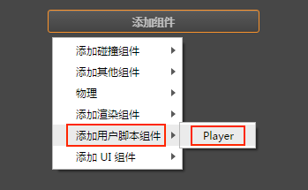
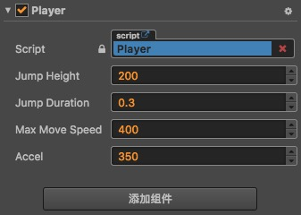
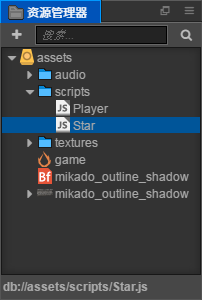
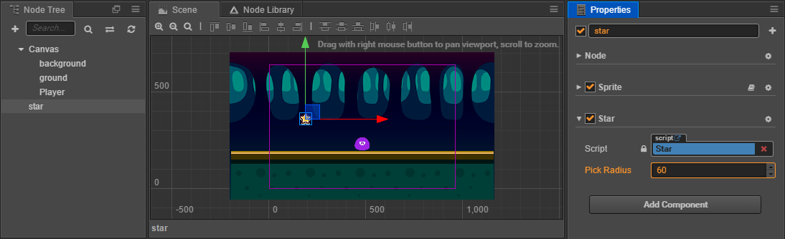
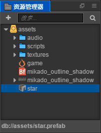
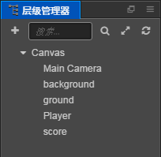
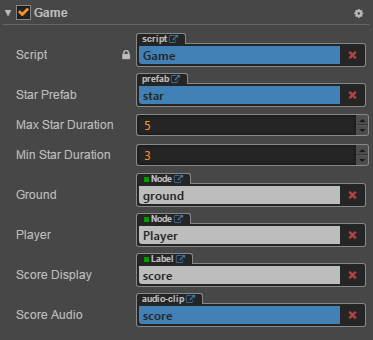
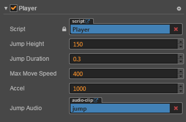

# Cocos Creator --快速上手：制作第一个游戏

当然，首先，按部就班的下载项目文件，然后用Cocos Creator打开项目。

如果下的是初始项目文件，那么只有在asset下面是有东西的，这些东西就是接下来要用到的资源。

## 流程图

接下来就是制作这第一个游戏的大体流程：

```flow
start=>start: 开始
createScene=>operation: 创建游戏场景
setScene=>operation: 设置场景图像
addRole=>operation: 添加主角
editRoleScript=>operation: 编写主角脚本
addStar=>operation: 制作星星
addGameControlScript=>operation: 添加游戏控制脚本
addScore=>operation: 添加得分
overAndRestart=>operation: 失败判定和重新开始
addSound=>operation: 加入音效
end=>end: 结束

start->createScene->setScene->addRole->editRoleScript->addStar->addGameControlScript->addScore->overAndRestart->addSound->end
```

当然这里只是这一个例子的大体流程，细节会逐渐加以说明。

## 创建游戏场景

1. 在 **资源管理器** 中点击选中 **assets** 目录，确保我们的场景会被创建在这个目录下

2. 点击 **资源管理器** 左上角的加号按钮，在弹出的菜单中选择 **Scene**

   

3. 我们创建了一个名叫 `New Scene` 的场景文件，创建完成后场景文件 `New Scene` 的名称会处于编辑状态，将它重命名为 `game`。**这里要注意的是，在macos版本中改名后要回车确定而不是用鼠标点击别的地方来确定，不然虽然界面上已经改了，但实际上的对象名字以及相应的文件名还是`New Scene`，windows版本是否有这个问题不知**。

4. 双击 `game`，就会在 **场景编辑器** 和 **层级管理器** 中打开这个场景。

## 设置场景图像

这一步主要是一些界面上的拖曳操作。

```flow
addBackGround=>operation: 添加背景
setBackGround=>operation: 设置背景
addFloor=>operation: 添加地面
setFloor=>operation: 设置地面
addRole=>operation: 添加主角

addBackGround->setBackGround->addFloor->setFloor->addRole
```

## 编写主角脚本

添加主角的界面操作已经归入上一步，这一步编写主角的动作控制脚本。

### 创建脚本

具体的看原文档即可。这里另外注意的是cc本身并没有提供编辑脚本的功能，要编辑脚本需要使用另外的编辑器，双击资源树上的脚本所打开的程序跟你自己操作系统的设置有关。我习惯使用vim，所以是直接用vim打开脚本来进行编辑，双击会打开浏览器。

### 编写组件属性

同样看原文档。这里需要了解的是，脚本创建好之后，需要把这个脚本或者说组件添加到主角节点上。

在 **层级管理器** 中选中 `Player` 节点，然后在 **属性检查器** 中点击 **添加组件** 按钮，选择 `添加用户脚本组件 -> Player`，为主角节点添加 `Player` 组件。



添加好之后，就可以在 **属性检查器** 中（需要选中 `Player` 节点）看到刚添加的 `Player` 组件了，如下图，可以在这里将主角跳跃和移动的相关属性设置好，而不需要再去编辑脚本文件：



### 编写跳跃和移动代码

具体参见原文档。到这一步就可以预览游戏了，当然还没有什么具体功能。

### 移动控制

具体参见原文档。

## 制作星星

### 制作Prefab(预制资源)

所谓Prefab，是作为一个模板，以备将来重复生成节点时使用。

首先从 **资源管理器** 中拖拽 `assets/textures/star` 图片到场景中，位置随意，这里只是需要借助场景作为制作 Prefab 的工作台，制作完成后会把这个节点从场景中删除。

不需要修改星星的位置或渲染属性，但需要为星星添加一个专门的组件来控制星星的行为。按照和添加 `Player` 脚本相同的方法，添加名叫 `Star` 的 JavaScript 脚本到 `assets/scripts/` 中。



接下来编辑这个脚本。

然后将这个脚本添加到刚创建的 star 节点上，在 **层级管理器** 中选中 star 节点，然后在 **属性检查器** 中点击 **添加组件** 按钮，选择 `添加用户脚本组件 -> Star`，该脚本便会添加到刚创建的 star 节点上。然后在 **属性检查器** 中把 `Pick Radius` 属性值设为 `60`：



Star Prefab 需要的设置就完成了，现在从 **层级管理器** 中将 star 节点拖拽到 **资源管理器** 中的 `assets` 文件夹下，就生成了名叫 `star` 的 Prefab 资源。



现在可以从场景中删除 star 节点了，后续可以直接双击这个 `star` Prefab 资源进行编辑。

## 添加游戏控制脚本

参见原文档。脚本编辑好后，需要将 Game 组件添加到 **层级管理器** 中的 Canvas 节点上（选中 Canvas 节点后，拖拽脚本到 **属性检查器** 上，或者点击 **属性检查器** 的 **添加组件** 按钮，并从 `添加用户脚本组件` 中选择 `Game`。）

接下来从 **资源管理器** 中拖拽 `star` 的 Prefab 资源到 Game 组件的 `Star Prefab` 属性中。这是我们第一次为属性设置引用，只有在属性声明时规定 `type` 为引用类型时（比如我们这里写的 `cc.Prefab` 类型），才能够将资源或节点拖拽到该属性上。

接着从 **层级管理器** 中拖拽 ground 和 Player 节点到 Canvas 节点 Game 组件中相对应名字的属性上，完成节点引用。

然后设置 `Min Star Duration` 和 `Max Star Duration` 属性的值为 `3` 和 `5`，之后我们生成星星时，会在这两个之间随机取值，就是星星消失前经过的时间。

### 在随机位置生成星星

参见原文档。

### 添加主角碰触收集星星的行为

参见原文档。

## 添加得分

### 添加分数文字（Label）

创建一个 Label 节点。在 **层级管理器** 中选中 Canvas 节点，右键点击并选择菜单中的 `创建新节点 -> 创建渲染节点 -> Label（文字）`（因为macos中并没有右键菜单，所以也可以选中Canvas节点，然后点击那个+号，）一个新的 Label 节点会被创建在 Canvas 节点下面，而且顺序在最下面。接下来配置这个 Label 节点：

1. 将该节点名字改为 `score`
2. 将 score 节点的位置（`position` 属性）设为 `(0, 180)`。
3. 选中该节点，编辑 **属性检查器** 中 Label 组件的 `string` 属性，填入 `Score: 0` 的文字。
4. 将 Label 组件的 `Font Size` 属性设为 `50`。
5. 从 **资源管理器** 中拖拽 `assets/mikado_outline_shadow` 位图字体资源（注意图标是 ）到 Label 组件的 `Font` 属性中，将文字的字体替换成我们项目资源中的位图字体。

### 在 Game 脚本中添加得分逻辑

参见原文档。编辑并保存 Game 脚本后，回到 **层级管理器**，选中 Canvas 节点，然后把前面添加好的 score 节点拖拽到 **属性检查器** 里 Game 组件的 `Score Display` 属性中。

### 在 Star 脚本中调用 Game 中的得分逻辑

参见原文档。

## 失败判定和重新开始

参见原文档。

## 加入音效

参见原文档。

编辑并保存脚本后，回到 **层级管理器** ，选中 Player 节点，然后从 **资源管理器** 里拖拽 `assets/audio/jump` 资源到 Player 组件的 `Jump Audio` 属性上。

然后选中 Canvas 节点，把 `assets/audio/score` 资源拖拽到 Game 组件的 `Score Audio` 属性上。

## 最后

完成形态的场景层级和各个关键组件的属性如下：







总之，大体上一个游戏的制作流程便是如此。