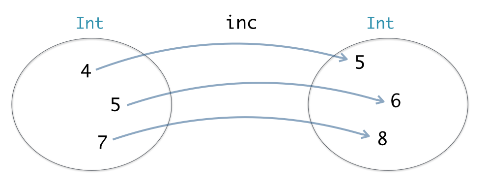

# Haskell的一些杂七杂八的东西

[TOC]
## 随看随记的东西

### 普通函数、中缀函数(运算符)

#### 转化

```haskell
`普通函数` => 中缀函数
(中缀函数) => 普通函数
```

#### 优先级

- 普通函数优先级高于中缀函数

- 中缀函数优先级0-9，9最高

- 没有结合性的中缀函数不能连写，必须加括号，比如

  ```haskell
  x `elem` xs `elem` ys是不对的，必须加上括号：
  （x `elem` xs） `elem` ys
  或者
  x `elem` （xs `elem` ys）
  ```
- ::优先级最低

### 命名风格

- 构造函数，用CamelName
- 其他函数，用camelName
- 自定义类型，CamelName

### `x -> y -> z`

表示两个参数*x*，*y*，返回*z*，也就是最后一个`->`后面的那个标志符是返回值，前面的`->`只是把参数分隔开，如果只有一个参数，就不需要`->`了

### `=>`

表示一个约束，`A a => [a]`表示*a*具有*A*的性质。

### 数据申明 data 
*Type = MakeType arg1 arg2*
基本上类似于

```C++
class Type{
    Type MakeType(arg1,arg2);
}
```
而
*data Type = Type arg1 arg2*
也类似于

```C++
class Type{
    Type(arg1,arg2)
}
```

当然不能机械套用，只是说明一下类型是类型，函数是函数，构造函数是允许跟类型同名的，而C++里面这是必须的。

另外还可以

*data Type = arg1 :op arg2*，于是`:op`就是*Type*的构造运算符，可以这样用

```haskell
1.5 :op 2
(:op) 1.5 2
```

### 模式匹配

来看这段代码

```haskell
module Test where
data Position = MakePosition Double Double

distance :: Position -> Position -> Double
distance p1 p2 =
    case p1 of
        MakePosition x1 y1 ->
            case p2 of
                MakePosition x2 y2 -> sqrt((x1 - x2)^2 + (y1 - y2)^2)
                
pointA :: Position
pointA = MakePosition 0 0

pointB :: Position
pointB = MakePosition 3 4
```

显然，如前述，*`data Position = MakePosition Double Double`*定义了一个类型Position，以及这个类型的构造函数。姑且就先算是定义吧，毕竟这里的构造函数如果理解为返回了一个Position，其实也没什么问题。

接下来*`distance :: Position -> Position -> Double`*不如理解为一个约束，事实上，申明在任何一门语言当中都可以认为是个约束，规定了这个函数的参数个数和返回值以及它们各自的数据类型，而`->`也可以理解为***满足前一个条件则往下***。对*distance*做了一个约束之后，就可以开始定义模板了：显然*distance*有两个参数，*case p1 of  MakePosition x1 y1*判断*p1*满足是*Position*类型这么个条件，满足则下一个，也就是判断*p2*的类型，继续满足，于是计算*sqrt*。

接下来对*pointA*和*pointB*的处理就通常理解好了，不外乎申明了一个变量，并赋了值。

实际上，这段模式匹配以及所谓的绑定，在许多其他语言中是由编译器处理的。也就是说，判断实际参数的类型，并将其与名义参数绑定，是由编译器做的。这样一看，应该就不会对所谓的模式匹配不明觉厉了。

所以，必然有个普通样式的函数定义：

```haskell
distance :: Position -> Position -> Double
distance (MakePosition x1 y1) (MakePosition x2 y2) =
	sqrt((x1 - x2)^2 + (y1 - y2)^2)
```

以及一个略有些怪异的版本：

```haskell
distance p1 p2 =
	let MakePosition x1 y1 = p1
		MakePosition x2 y2 = p2
	in sqrt((x1 - x2)^2 + (y1 - y2)^2)
```

进而有

```haskell
distance p1@(MakePosition x1 y1) p2@(MakePosition x2 y2) =
	sqrt((x1 - x2)^2 + (y1 - y2)^2)
```

但是不管怎么定义，调用的时候总是用*distance p1 p2*的形式。

### 列表`[]`

```haskell
data [a] = a : [a] | []
```

定义了一个类型`[]`，这个类型通常称为列表，以及列表的构造函数`:`和`[]`，这个`[]`表示构造一个空表。

列表要这样用：

```haskell
lista = [1,2,3,4]
listb = 3 : lista
```

## 以上是看一本中文书时的笔记，再次验证中文书就是不靠谱，一边看一边还得自己脑补，看得累，所以还是老老实实上官网看文档。暂时就不删了，如果跟将来有什么不同或者混淆的地方，以将来的说法为准，这里保留的目的是为了证明前面说的中文书就是不靠谱不是瞎说的。接下来要看的文档是 :

## [Learning Haskell](http://learn.hfm.io/index.html "by Gabriele Keller and Manuel M T Chakravarty") 

### First Step

#### Values 

似乎对应于其他语言的*字面量*(*literal*)，比方说，`5`(整型数值)，`”hello world!“`(字符串)，`3.141`(浮点数)。

#### 常用类型

- `Int` = {…, `-3`, `-2`, `-1`, `0`, `1`, `2`, `3`, …}
- `Float` = {…, `-1232.42342`, …, `1.0`, `3.141`, …}
- `Double` = {… , `-1232.42342`, …, `1.0`, `3.141`, …}
- `Char` = {…, `'a'`, `'A'`, `'b'`, `'B'`, …`'1'`, …, `'@'`, `'#'`, …}
- `String` = {`""`, `"a"`, `"b"`, …, `"Hi"` ,`"3423#"`, …}
- `Bool` = {`False`, `True`}

这个没什么好解释的

#### `::`

`1 :: Int`可以读作“`1` *的类型是* `Int`“,

#### 函数定义 

一个函数定义包括一个*head*和一个*body*以及一个`=`。比方说：

#### 嵌套调用

以上面函数为例，

> `inc (inc 5)`  ⇒  `inc (5 + 1)`  ⇒  `inc 6`  ⇒  `6 + 1`  ⇒  `7`

#### 命名规则

- 以小写字母或者`_`开头，这条不是强制而是惯例
- 只能包含字母，数字，`_`，`’`
- 不能重名，函数跟函数不能重名，变量跟变量不能重名，函数跟变量也不能重名

#### 函数是映射

函数是个映射，唔，这才是函数本来的奥义呀，比方说：



#### Type Signatures

一个函数的定义是这样的：

```haskell
inc :: Int -> Int     -- type signature
inc x = x + 1         -- function equation
```

类型签名是可选的，不过它的主要作用一个是给程序员看，另一个是帮助haskell系统检查类型错误，所以还是有必要的。

#### Multiple Arguments 及柯里化

```haskell
average :: Float -> Float -> Float
average a b  = (a + b) / 2.0
```
`Float -> Float -> Float`可以理解为`Float -> (Float -> Float)`，因为`->`是右结合的，意思就是`Float -> Float -> Float -> Float`可以理解为`Float -> (Float -> (Float -> Float))`，当然这里说的是函数签名，而不是调用过程，不要理解为会先计算最右边的那个表达式。

函数调用语句或者说表达式是左结合的，比方说

`average 3.0 4.0`

就等价于

`(average 3.0) 4.0`。

这里并没有矛盾，因为`(average 3.0)`实际返回了一个新的函数，比方说叫`average_with_3_0 `，其定义为：

```haskell
average_with_3_0 :: Float -> Float
average_with_3_0 x = (x+3.0)/2
```

可以从另一个角度来考虑，这里本质上就是:
$$
average:Float \to average' \\
average':Float \to Float
$$
$average$和$average’$分别是两个数学意义上的映射。或者

```haskell
average':Float -> Float
average:Float -> average'
```

如果不支持LaTeX的话。

这种每次绑定一个参数，然后返回一个新函数的处理称之为柯里化，haskell中所有的函数都是这样处理的，缺省情况下。

#### 中缀和前缀

- (中缀)就变成前缀：
```haskell
(+) 1 5
```
等价于 
```haskell
1 + 5
```
- \`前缀\`就变成中缀：
```haskell
6.9 `average` 7.25
```
等价于

```haskell
average 6.9 7.25
```

#### 二元运算符左结合性

```haskell
6.9  `average` 7.25 `average` 3.4
```

等价于

```haskell
(6.9  `average` 7.25) `average` 3.4
```

#### `=>`

只是在函数的类型签名中用到这个符号，表示对值的一个约束。比如：

```haskell
(+) :: Num a => a -> a -> a
```

表示`a`是一个`Num`类型的值

#### 常用*type classes*和重载函数

- Typeclass `Show`
  - 函数： `show :: Show a => a -> String` 。
  - 成员类型：几乎所有的预定义类型，除了函数类型。
- Typeclass `Eq`
  - 函数：`(==), (/=) :: Eq a => a -> a -> Bool` 
  - 成员类型： 几乎所有的预定义类型，除了函数类型。
- Typeclass `Ord`
  - 函数： `(<), (>), (<=), (>=) :: Ord a => a -> a-> Bool`
  - 成员类型： 几乎所有的预定义类型，除了函数类型。
  - 所有属于`Ord`的类型都已经属于`Eq`, 所以如果要对同一个值使用 `==` 或者 `<` ，这个值属于`Ord`就可以了。
- Typeclass `Num`
  - 函数：`(+), (-), (*) :: Num a => a -> a -> a`
  - 成员类型：`Float`, `Double`, `Int`, `Integer`
- Typeclass `Integral`
  - 函数：`div, mod :: Integral a => a -> a -> a`
  - 成员类型：`Int` (固定精度), `Integer` (可变精度)
- Typeclass `Fractional`
  - 函数： `(/) :: Fractional a => a -> a -> a`
  - 成员类型：`Float`, `Double`
- Typeclass `Floating`
  - 函数： `sin, cos, tan, exp, sqrt,… :: Floating a => a -> a`
  - 成员类型：`Float`, `Double`

总结一下就是

- 除了函数类型，其它所有的类型都属于Show，Eq，Ord，也就是可以转换成字符串，可以比较，可以排序。注意

  `show “hello，world”`的结果会是`“\”hello,world\””`。

- 只有Float、Double、Int、Integer可以进行`+, -, *`运算。

- 只有Int、Integer可以做`div, mod`运算。

- 只有Float、Double可以做`/`运算以及数学函数运算。

- typeclass必要时可以组合使用，比如：

  ```go
  signum :: (Ord a, Num a) => a -> Int
  signum x = if x < 0 then -1 else if x == 0 then 0 else 1
  ```

  `a -> Int`改成`a -> a`也是可以的，不过这个函数要注意下面的问题：

  ```haskell
  *Test> signum (-1)
  -1
  *Test> signum (0-1)
  -1
  *Test> signum 0-1
  -1
  *Test> signum 2-5
  -4
  *Test> signum (2-5)
  -1
  *Test> signum -5
  
  <interactive>:46:1: error:
  ```

  这里主要是提醒注意signum是函数，`-`也是，而且`-`不但是二元减法运算符，也是一元取负运算符，并且他们仨的优先级相同，而函数调用是左结合的，这样就能理解上面的执行结果了。

- 句法上，Typeclass所在的位置必须是Typeclass，不能是具体的类型名字，比如上面的`(Ord a, Num a) `改成`(Ord a, Int a) `是不行的。

### Fundamentals

#### module 

句法：

```haskell
module Simple
where
--module body
```

`where`放第一行也是可以的。module名字首字母必须**大写**。

#### 分支

也就是*if .. then .. else ..*及其各种变形

```haskell
signum :: (Ord a, Num a) => a -> Int
signum x = if x < 0 then -1 else if x == 0 then 0 else 1

signum :: (Ord a, Num a) => a -> Int
signum x | x <  0  = -1
         | x == 0  = 0
         | x >  0  = 1
         
signum :: (Ord a, Num a) => a -> Int
signum x | x <  0     = -1
         | x == 0     = 0
         | otherwise  = 1
```

以上3个*signum*是等价的，也同样在`x<0`的时会有一些问题。

#### Binders

所谓绑定，理解为固定赋值就好了，与赋值不同的是绑定之后就不能再变了，所以叫绑定而不是赋值。

可以把一个值绑定到一个标识符，这个通常叫常量了

```haskell
pi :: Floating a => a
pi = 3.141592653589793
```

这是所谓全局绑定，还有局部绑定

```haskell
circleArea' :: Floating a => a -> a
circleArea' diameter  = pi * radius * radius
  where
    radius = diameter / 2.0       -- local binding
```

这里circleArea’是个全局绑定的名字，而radius则只限于这个函数当中。

对于绑定本身没有什么特别的，只是要注意作用范围内，绑定不可更改。

#### (形参)多态函数

看例子

```haskell
fst :: (a, b) -> a
fst (x, y)  = x

snd :: (a, b) -> b
snd (x, y)  = y
```

这里没有类型签名，因为，fst和snd都不对参数进行运算，所以不用管参数的类型是什么，a，b的类型甚至可以不一样。这种函数叫**(形参)多态函数**

#### 元组

还是看例子

```haskell
type Point = (Int, Int)
origin :: Point
origin  = (0, 0)

moveRight :: Point -> Int -> Point
moveRight (x, y) distance  = (x + distance, y)

moveUp :: Point -> Int -> Point
moveUp (x, y) distance  = (x, y + distance)
```
注意一下*type*的定义方式，以及*origin*的绑定方式，也就是直接赋了一个值。

以及

```haskell
type Colour = String
type ColourPoint = (Int, Int, Colour)
origin :: Colour -> ColourPoint
origin colour  = (0, 0, colour)

move :: ColourPoint -> Int -> Int -> ColourPoint
move (x, y, colour) xDistance yDistance  
  = (x + xDistance, y + yDistance, colour)

distance :: ColourPoint -> ColourPoint -> Float
distance (x1, y1, colour1) (x2, y2, colour2) 
  = sqrt (fromIntegral (dx * dx + dy * dy))
  where
    dx = x2 - x1
    dy = y2 - y1
```
这里*origin*是个函数，而不是前面那个例子的常量或者说变量。*where*后面是局部绑定，不是*SQL*的条件，更不是*while*。

### error

*Prelude*包中有个*error*函数：

```haskell
error :: String -> a
```

那个*a*表示什么类型都有可能，因为不用对*a*进行运算，所以不需要知道其类型，也就不用类型签名了。

这个函数可以理解为抛出异常并打印一段提示：

```haskell
error "encountered a fatal error"  ⇒  ** Exception: encountered a fatal error
```


## 递归

### 计算

```haskell
natSum :: Num a => a -> a
natSum 0  = 0                    
natSum n  = n + natSum (n - 1) 
```

和

```haskell
natSum :: Num a => a -> a
natSum n = if n == 0 
              then 0 
              else n + natSum (n - 1)
```

是一样的。不过这两种定义，在n<0时是不会终止的，也就是说这是个*partial*函数。

所以需要这样定义

```haskell
natSum :: (Num a, Ord a) => a -> a
natSum 0              = 0
natSum n  | n > 0     = n + natSum (n - 1) 
          | otherwise = error "natSum: Input value too small!"
```

### List

```haskell
repeatN :: Int -> a -> [a]
repeatN 0 x  = []
repeatN n x  = x : repeatN (n - 1) x
```

这里递归生成了一个所有元素都相同的列表。

```haskell
suffixes :: String -> [String]
suffixes ""  = []
suffixes str = str : suffixes (tail str)
```

比方说：

> ```haskell
> suffixes "Hello"`  ⇒  `["Hello", "ello", "llo", "lo", "o"]
> ```

### *nil* 和 *cons*

*nil*：`[]`

*cons*: `:`

这两个运算符就可以构造任意的列表了。

比方说

```haskell
[x1, x2,… , xn] = (x1 : (x2 : ⋯ : (xn : [])⋯)
```

实际上，后面的`()`里边的递归形式的表示方式是列表的原始方式，`[]`表达方式只是一种便利。

所以我们可以这样表示两个函数

```haskell
head :: [a] -> a
head (x:xs) = x

tail :: [a] -> [a]
tail (x:xs) = xs
```

当然我们知道这两个函数是*partial functions*，因为没有处理空列表的情况。

### 映射：操作列表元素

```haskell
allSquares :: Num a => [a] -> [a]
allSquares []       = []
allSquares (x : xs) = x * x : allSquares xs
```

> ```haskell
> allSquares [x1, x2,… , xn]` = `[x1 * x1, x2 * x2,… , xn * xn]
> ```

```haskell
import Data.Char 

allToUpper :: String -> String
allToUpper []                 = []
allToUpper (chr : restString) = toUpper chr : allToUpper restString
```

> ```haskell
> allToUpper "can you hear me now?`  ⇒  `"CAN YOU HEAR ME NOW?"
> ```

要记得列表的`(x:xs)`这种表示方式。以及，*String*本身是个列表。

此外，最关键的是这种模式：

```haskell
recursiveFunction []       = []
recursiveFunction (x : xs) = doSomethingWith x : recursiveFunction xs
```

再看一个例子

```haskell
distancesFromPoint :: ColourPoint -> [ColourPoint] -> [Float]
distancesFromPoint point []
  = []
distancesFromPoint point (p : ps)
  = distance point p : distancesFromPoint point ps
```

计算一个点与一组点之间的距离。*ColourPoint*和*distance*的定义在前面。

### 过滤：移除列表元素

```haskell
import Data.Char

extractDigits :: String -> String
extractDigits []
  = []
extractDigits (chr : restString)
  | isDigit chr = chr : extractDigits restString
  | otherwise   =       extractDigits restString
```

> ```haskell
> extractDigits "das43 dffe 23 5 def45" => "4323545"
> ```

以及

```haskell
inRadius :: ColourPoint -> Float -> [ColourPoint] -> [ColourPoint]
inRadius point radius []
  = []
inRadius point radius (p : ps)
  | distance point p <= radius = p : inRadius point radius ps
  | otherwise                  =     inRadius point radius ps
```

相当于指定一个圆心为point半径为radius的圆，找出列表中所有位于圆内或者圆上的点。

### Reductions: combining the elements of a list

不确定标题该怎么翻译，意思就是通过对列表元素的一些组合或者合并操作实现缩减。

比如

```haskell
product :: Num a => [a] -> a
product []     = 1
product (x:xs) = x * product xs
```

当然这是递归，只不过与前面不同的是在空表是返回1，而不是0。

## Higher-order Functions
所谓*higer-order functions*就是那种用函数作为参数的函数，以及返回函数的函数，其实是很普通的概念。
```haskell
import Prelude hiding (map)

map :: (a -> b) -> [a] -> [b]
map f []       = []
map f (x : xs) = f x : map f xs
```

注意第一行的hiding (map)。

这里定义的map函数，有两个参数：*f* 和*(x:xs)*。从签名看，*f*代表一个函数*(a->b)*，*xs*是个元素为a类型的List，而结果则是一个元素类型为b的List。要记得一个List的*(x:xs)*这种表达方式，并不是说会自动把*xs*拆分成*(x:xs)*，而是*xs*本身就是*(x:xs’)*，体会一下区别。递归的基本部分我们忽略，只看递归部分，这里就是说map的第一个参数，函数*f*，处理第二个参数List *xs*的队首，*xs*的队尾则继续递归。更进一步，就是*xs*的队首是函数*f*的参数，一个a类型的元素，经过*f*处理后返回一个b类型的元素，并且与剩下的递归部分通过`:`运算生成一个b类型的List。

总之，map定义了一个递归函数的模板，将一个函数，也就是其第一个参数*f*，映射到待处理的数据，一个List(x:xs)上，最终返回经过*f*对数据处理的结果。

注意的是这里用了`:`来生成一个List，这也是map的签名规定了的，如果我们要求的结果不是一个List，而是其他的一个什么，比方说累加值，这个时候map的签名中返回值就不应该是[b]，而是b，或者a，当然b也可能就是a。

实际上，最后的返回值也不一定要跟a或者b有什么关系，当然此时这个函数就不叫map，而是一个别的什么名字了，比方说**reduce**，或者**filter**，或者**zipWith**。


我们来看第一个例子

```haskell
allSquares :: Num a => [a] -> [a]
allSquares xs = map square xs
  where
    square x = x * x
```
于是*square*以*xs*的队首元素为参数并返回其平方，而*xs*的队尾继续递归。

第二个例子
```haskell
allToUpper :: String -> String
allToUpper string = map toUpper string
```
于是*toUpper*以string的第一个字符为参数并将其转换成大写，string剩下的字符继续递归。

再看一个复杂一些的
```haskell
distancesFromPoint :: ColourPoint -> [ColourPoint] -> [Float]
distancesFromPoint point points = map distanceP points
  where
    distanceP :: ColourPoint -> Float
    distanceP p = distance point p
```
这里就不说map的语义了。说复杂，并不是说map变得复杂，而是*distancesFromPoint*带了两个参数，第一个参数*point*并没有在map里边出现，而是出现在了*where*子句中*distanceP*的定义中，并且在其后的递归中保持不变，会变的只是map的第二个参数，那个**List**。

### 匿名函数

也叫闭包，或者别的一些什么名字，闭包是个比较通用的叫法了。

```haskell
functionName a1 a2 ⋯ an = body
```

与

```haskell
\a1 a2 ⋯ an -> body
```

是等价的，也就是说这个匿名函数，在参数列表前用`\`代替了函数名，同时把绑定符号`=`用`->`代替，其它的就没有了。当然匿名函数终究要符合闭包的使用条件。比方说

```haskell
nRadius :: ColourPoint -> Float -> [ColourPoint] -> [ColourPoint]
inRadius point radius points = filter (\p -> distance point p <= radius) points

llSquares :: Num a => [a] -> [a]
allSquares xs = map (\x -> x * x) xs
```

上面filter的定义是：

```haskell
filter :: (a -> Bool) -> [a] -> [a]
filter p []
  = []
filter p (x : xs)
  | p x       = x : filter p xs
  | otherwise = filter p xs
```

### Point-free notation and partial application

使用map的函数定义并不检查参数列表，所以我们可以

```haskell
allSquares :: Num a => [a] -> [a]
allSquares = map (\x -> x * x)
```

考虑map的类型

```haskell
map :: (a -> b) -> [a] -> [b]
```

于是map就生成了一个新的函数

```haskell
allSquares = map (\x -> x * x)
```

怎么理解呢，初看起来这就像是个宏替换，不过在haskell中有个概念叫柯里化，也就是说，从map的类型来看，`map (\x -> x * x)`会得到一个新函数，这个函数以`[a]`为参数，而这里由`map (\x -> x * x)`得到的这个函数绑定到了*allSquares*上。其实我们在写C代码的时候也经常会使用宏替换来实现这样的功能，不过那个需要仔细调试，毕竟编译器在预编译的时候不会做任何检查，只是简单替换。

其他的所谓*high-order*函数都可以类似处理，也就是在绑定函数定义的时候不加参数列表，只要生成一个函数即可，因为这个参数列表也只是传递到新生成的这个函数。

